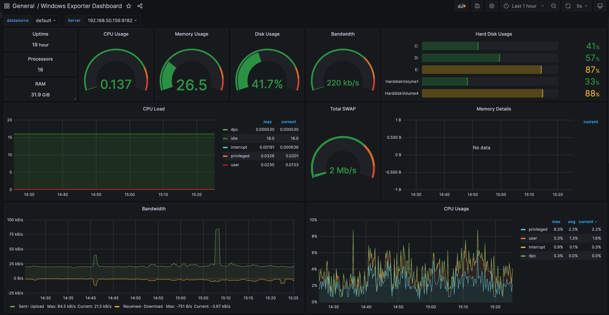

## 安装部分

打开终端（管理员模式）

```powershell
# 全收集模式
msiexec.exe /i windows_exporter-0.22.0-amd64.msi ENABLED_COLLECTORS="ad,adcs,adfs,cache,cpu,cpu_info,cs,container,dfsr,dhcp,dns,exchange,fsrmquota,hyperv,iis,logical_disk,logon,memory,mscluster_cluster,mscluster_network,mscluster_node,mscluster_resource,mscluster_resourcegroup,msmq,mssql,netframework_clrexceptions,netframework_clrinterop,netframework_clrjit,netframework_clrloading,netframework_clrlocksandthreads,netframework_clrmemory,netframework_clrremoting,netframework_clrsecurity,net,os,process,remote_fx,service,smtp,system,tcp,teradici_pcoip,time,thermalzone,terminal_services,textfile,vmware_blast,vmware" TEXTFILE_DIR="C:\custom_metrics" LISTEN_PORT="9182"
```

```powershell
windows_exporter-0.22.0-amd64.exe --collectors.enabled "[defaults], cpu_info, logon, memory, process" TEXTFILE_DIR="C:\custom_metrics" LISTEN_PORT="9182"
```

## 监控面板

使用了[Windows Exporter Dashboard](https://grafana.com/grafana/dashboards/14694-windows-exporter-dashboard/)


